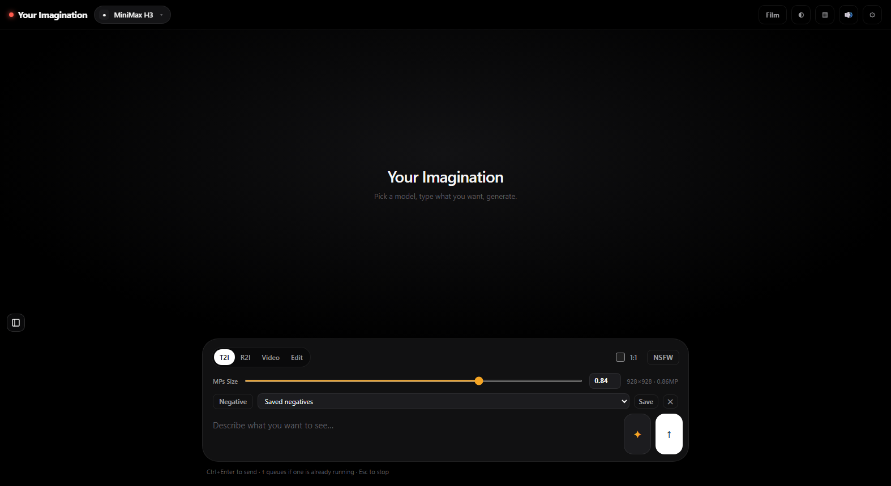
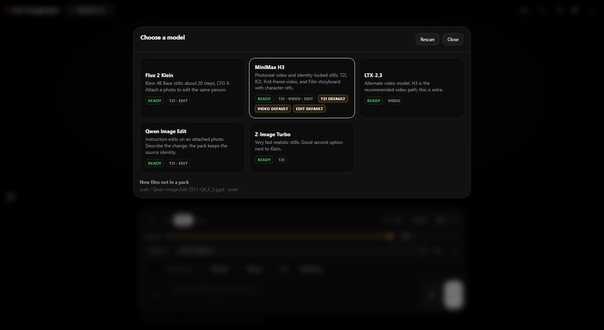
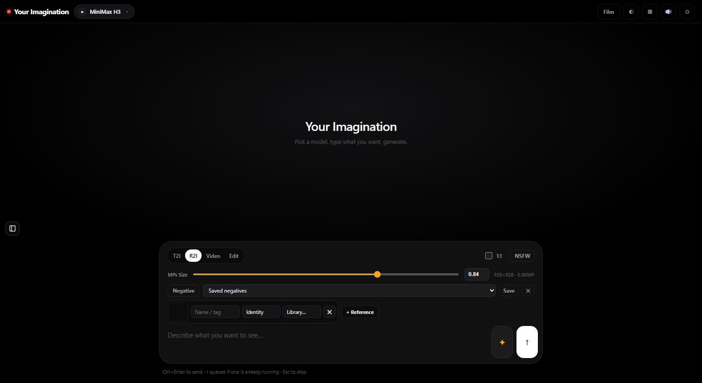
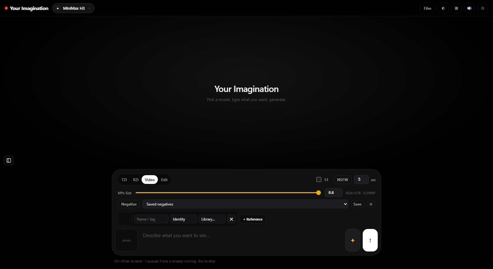
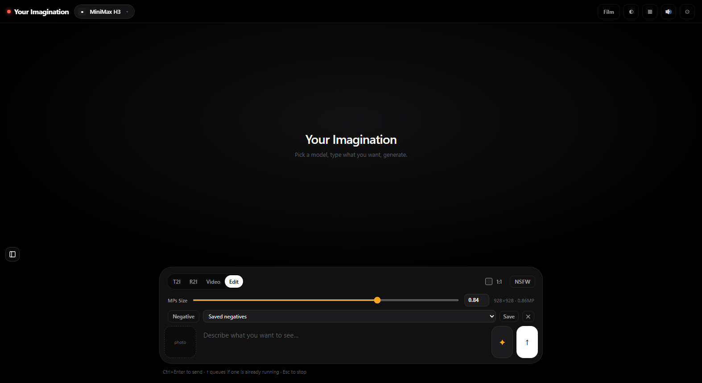
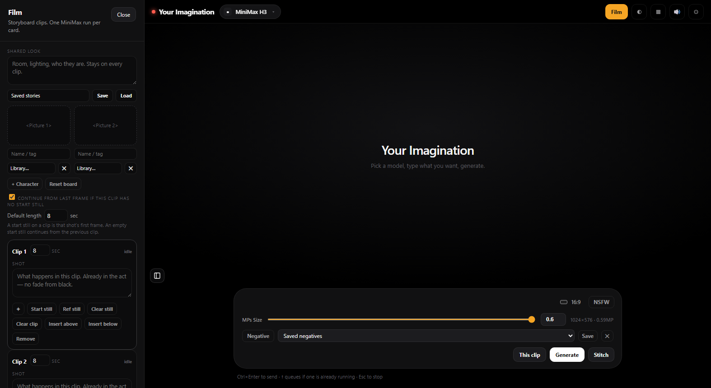

# Your Imagination

A local ComfyUI frontend: pick a model pack, then generate stills, reference-guided images, video, instruction edits, or a Film storyboard — without opening the graph editor.

The app runs on your machine, talks to ComfyUI on port `8188`, and does not need the internet once weights are on disk.



## Features

- **Packs** — Model cards for MiniMax H3, Flux 2 Klein, Z-Image Turbo, Qwen Image Edit, and LTX-2.3. Each pack declares the UNet, CLIP, VAE, and optional LoRAs it expects.
- **T2I** — Text to image from the prompt bar.
- **R2I** — Reference to image. Identity or scene pictures in the reference slots guide the still.
- **Video** — Text-to-video, or image-to-video from a start still. Clip length lives next to the mode pills.
- **Edit** — Instruction edits on an attached photo (Qwen Image Edit by default).
- **Film** — A storyboard for MiniMax H3: shared look, character refs, clip cards, continue-from-last-frame, then stitch.
- **Library** — Gallery of ComfyUI outputs and a prompt history.
- **NSFW** — Optional chip. When on, the loaded pack can use adult LoRAs you drop into `ComfyUI/models/loras`. The app still runs if those files are missing.

## Hardware

This UI is comfortable on **8GB laptop-class** NVIDIA GPUs. For MiniMax H3 video, **~0.6 megapixels** (about 1024×576 at 16:9) is the practical default. Raise the H3 video size cap in Settings if you have more VRAM; stills can go higher than video.

## Requirements

- Windows (primary), or macOS/Linux with `start-unix.sh`
- Python 3.10+
- [ComfyUI](https://github.com/comfyanonymous/ComfyUI) already installed (a portable NVIDIA build is fine)
- Model weights in `ComfyUI/models` (UNet, CLIP, VAE, and any LoRAs you want)

## Start (Windows)

1. Start ComfyUI if it is not already on `http://127.0.0.1:8188`.
2. Double-click `start-windows.bat`.
3. Open [http://127.0.0.1:7860](http://127.0.0.1:7860).

On first run, point the app at your `ComfyUI/models` folder if it is not found automatically. The header dot turns green when ComfyUI is connected. Use **Settings → Connect** if you started ComfyUI after the UI.

The launcher keeps its Python environment in `%LOCALAPPDATA%\YourImagination\venv`.

macOS/Linux: `./start-unix.sh`.

## Using the app

### Pick a pack

The chip in the header is the loaded pack. Open it to switch models, or use **Manage models** for the full card grid. A pack that does not support the current mode will switch you to one it can run.



### T2I, R2I, Video, Edit

| Mode | What it does |
| --- | --- |
| **T2I** | Prompt only. No reference slots. |
| **R2I** | Prompt plus identity/scene references. Use **+ Reference** and, if you have saved faces, the slot’s **Library** menu. |
| **Video** | Prompt, optional start **photo** (first frame), or reference slots for identity-locked video when the pack supports it. Set clip length in seconds. |
| **Edit** | Attach a photo and describe the change. |

Aspect ratio and megapixel size sit above the prompt. **Negative** is optional. **Ctrl+Enter** generates; **↑** queues if a job is already running; **Esc** stops.







### Character and reference slots

R2I, identity-locked video, and Film share the same idea: slots are pictures of *who* (or a scene), not the output frame.

- **Identity** — A face-forward crop of the person you want to keep.
- **Scene** — A pose or layout reference, when the slot offers that role.
- **Library** — Faces and refs you have already uploaded, so you do not re-drop the same file.

A start **photo** on Video or a Film clip is different: that image is the shot’s first frame.

### Film

Open **Film** for a MiniMax H3 storyboard.

- **Shared look** — Room, lighting, and who they are. Applied to every clip.
- **Character** slots — Identity refs for the story. Add more with **+ Character**.
- **Clips** — One MiniMax run per card. Write the action for that shot.
- **Start still** — That clip’s first frame. Leave it empty to continue from the previous clip’s last frame (when **Continue from last frame** is on).
- **Identity refs without a start still** — The pack can invent the opening pose from face crops (ref-to-video). A posed start still holds a specific composition more tightly.
- **This clip** / **Generate** — Run one card or the remaining cards.
- **Stitch** — Concatenate finished clip videos into one file.

Generate Film skips clips that already have a video.



### Settings

Defaults per mode, pack files (UNet / CLIP / VAE, recommended LoRAs, and optional LoRAs you drop in), ComfyUI address, models folder, and a privacy cover with an optional PIN. Generation keeps running while the cover is on.

## Layout

```
backend/          Flask app, ComfyUI proxy, pack scan, graphs, Film stitch
frontend/         UI
packs/            Model pack recipes
packs/custom/     Optional user packs (not required)
docs/screenshots/
start-windows.bat
start-unix.sh
```

## Notes

- Do not commit ComfyUI, model weights, or generated images. Those stay on the machine that runs ComfyUI.
- `data/` is local (Comfy path, saved defaults, gallery history, PIN hash) and is gitignored.
- Official pack weights can be downloaded from the pack inspector when a public URL exists. Optional adult LoRAs are files you add yourself.
- Refresh with nothing generating returns the homepage splash. A job that is still running reconnects.
